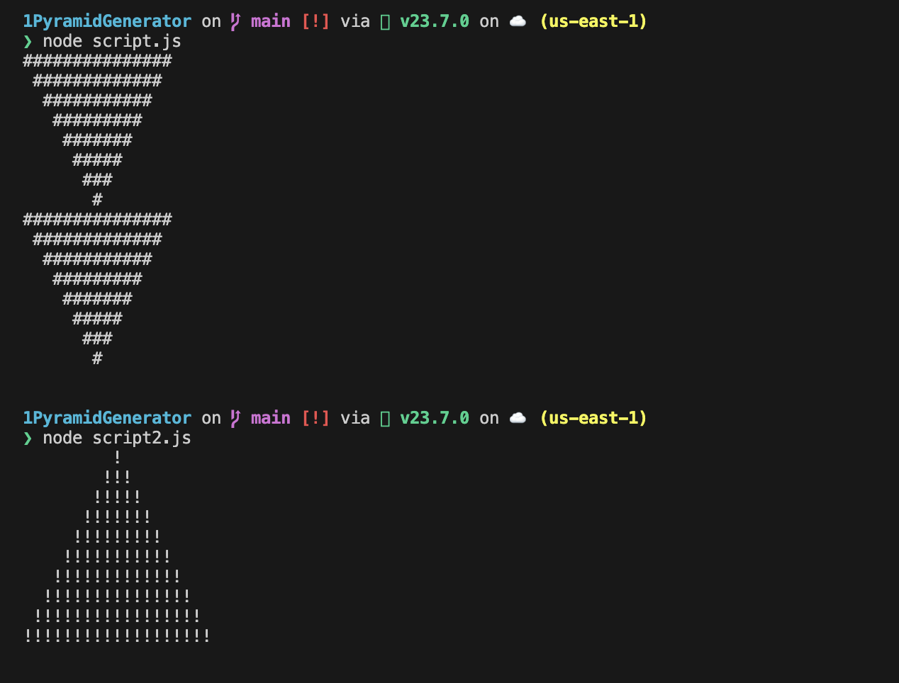

# JavaScript Pyramid Builder

  

## Overview

This project, **JavaScript Pyramid Builder**, is a coding exercise I completed as part of FreeCodeCamp's JavaScript Algorithms and Data Structures curriculum (Section 1). The goal was to create a centered pyramid using JavaScript, inspired by CS50's Mario problem, and I explored **six different methods** to build it—both right-side-up and upside-down. This project showcases my understanding of JavaScript fundamentals like loops, functions, arrays, and string manipulation, as well as my ability to experiment with multiple solutions to a single problem.

I’m currently coding 5x a week, preparing a portfolio for an Amazon role, and using this project to demonstrate my problem-solving skills and passion for coding. This repository includes two versions of the code: one with multiple methods combined and a simpler version with adjustable parameters.

## Features

- Builds a centered pyramid using a specified character (e.g., `#` or `!`).
- Supports both right-side-up and upside-down pyramids.
- Implements six different methods using `for` loops, `while` loops, `push`, and `unshift`.
- Adjustable parameters for pyramid height (`count`), character, and orientation (`inverted` flag).

## Installation

To run this project locally, you’ll need Node.js installed on your machine.

1. **Clone the Repository**:

```bash
git clone https://github.com/BenjaminBurton/Fundamental_JavaScript.git
```
